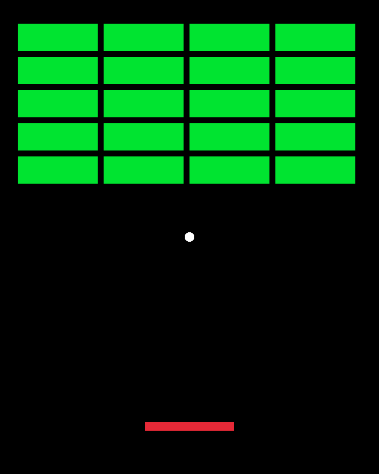

# Breakout

A simple implementation of [breakout](https://en.wikipedia.org/wiki/Breakout_(video_game)) using C++ and `raylib`
<p align="center">
  
</p>

## Dependencies
- **[Raylib](https://github.com/raysan5/raylib)**
- CMake

## Build Instructions
```bash
git clone --recursive https://github.com/piyush-ppradhan/breakout.git
cd breakout
mkdir build && cd build
cmake ..
make && ./../bin/breakout
```
Enjoy!
